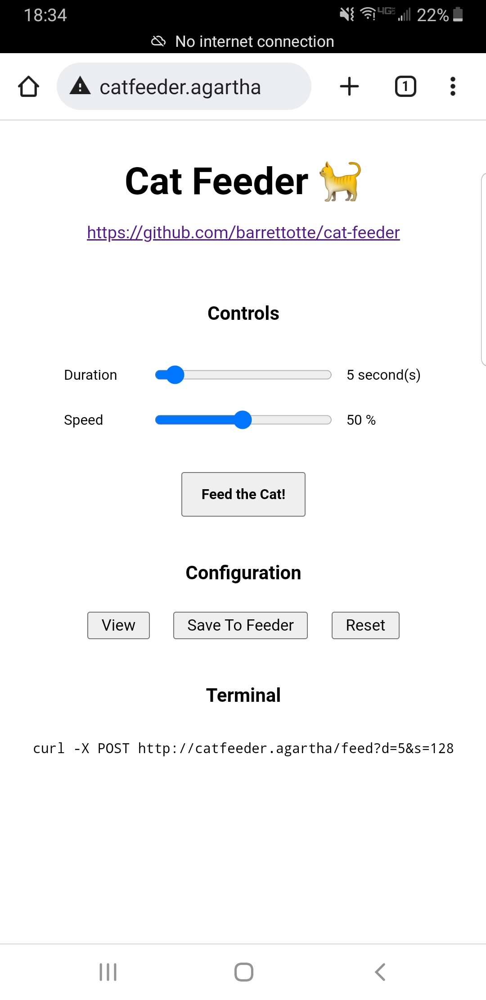
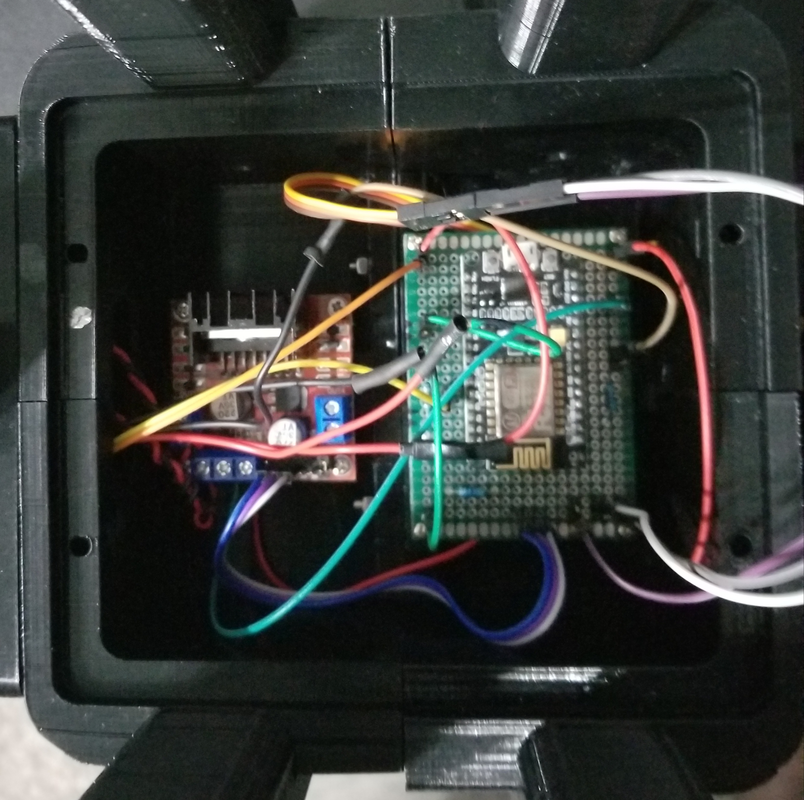
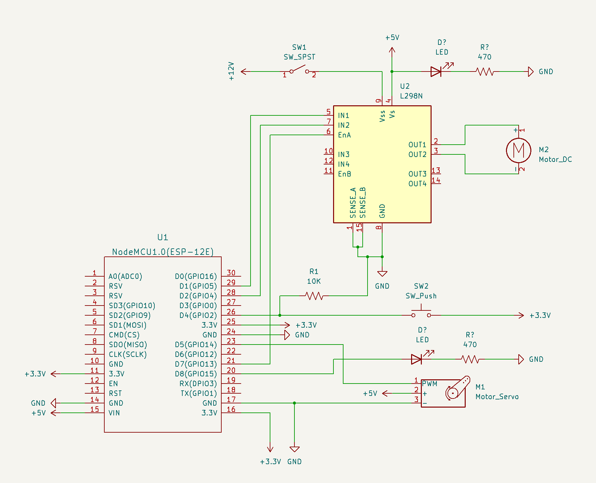
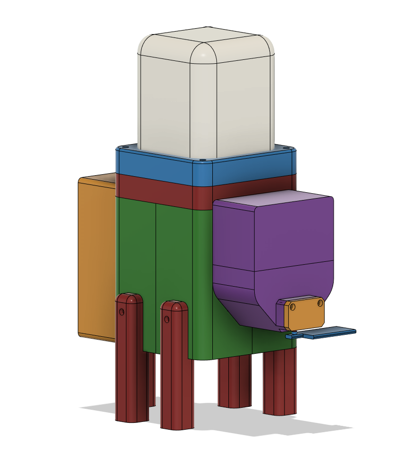

# cat-feeder

A cat feeder with a web interface

  
  

## Summary

A cat feeder utilizing a DC motor and an archimedes screw to dispense food.
The feeder hosts a web interface to configure and interact from any device's web browser.
The web interface also generates a corresponding `curl` command, so feed times could potentially be scheduled via cron jobs on another machine.

On the back of the feeder are two LEDs, a button, a power switch, and 12V DC power jack.
The button is used for manual feeding and can be configured via the feeder's web interface.
The "READY" LED is used to signal to the user that the state machine is in a state where either feeding or
initialization is in progress. When in this state, feed requests are blocked.

This project was put on hold for a couple months due to other projects and 3D printer problems.
I also screwed up the enclosure design at just about every point I could have.
This cat feeder is way too big, hard to assemble, and barely functional.

Additional improvements I wish I did:

- Non-hardcoded WiFi credentials - Have to recompile when changing networks...BAD.
- Serial port access - No way to reconcile errors/bugs via console.
- Don't use soldered jumper wires - Very bad/difficult solder joints, use custom dupont connectors next time.
- Less square nut inserts, More brass thread embedding - terrible to assemble with so many square nuts.
- More compact design - 3D printing large pieces was terrible.
- More modular design - Attempted this, but needs to be more modular for easy printing/assembly.
- Access holes for shaft, etc - Once sealed up, no way to tighten things easily.
- Sturdier motor mount - Seems to flex when pieces of food get jammed.
- Reprint bad enclosure pieces - Should have reprinted large enclosure pieces after resolving 3D printer problems.

But, oh well; Can't win 'em all. Time to move onto something else.
Maybe one day I'll redesign a better cat feeder from scratch when I've learned a lot more on design.

## Directories

- [fs/](fs/) - Filesystem uploaded to cat-feeder. Includes configuration JSON and web interface files.
- [fusion360/](fusion360/) - Fusion360 project file, exported models, and incomplete part list.
- [include/](include/) - Configuration for the feeder
- [inkscape/](inkscape/) - SVGs for back panel of feeder.
- [kicad/](kicad/) - Schematic and electronics parts list.
- [src/](src/) - Backend for the feeder.
- [test/](test/) - Test files and mock backend.

## Setup

- Configure WiFi credentials in `include/secrets.h`
- Upload to ESP8266 with `make upload`
- Set DHCP entry in router for cat-feeder MAC and IP
- Add DNS entry for `catfeeder.agartha`
- Power on, wait for ready LED to turn on (while feeder connects to WiFi)
- Saturate the feeder by running a few long feeds until food falls out of the chute
- Use the web interface at http://catfeeder.agartha to feed the cat

## CAD and Circuit Images

## Parts

- Electronics parts list is in [kicad/parts.md](kicad/parts.md)
- Incomplete hardware/3D-printed parts list is in [fusion360/parts.md](fusion360/parts.md)

## References

- https://www.youtube.com/watch?v=ICCWvEK6_tg
- https://www.youtube.com/watch?v=7lvErV4l5wQ
- https://microcontrollerslab.com/l298n-dc-motor-driver-module-esp8266-nodemcu/
- https://github.com/jdunmire/kicad-ESP8266
